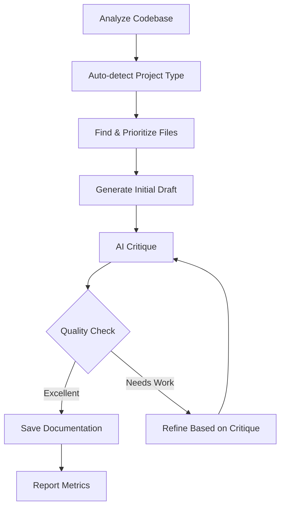

# AI Documentation Agent 🤖📝

An intelligent, self-improving AI agent that autonomously generates, critiques, and refines technical documentation for code projects using iterative improvement cycles.

[](https://www.python.org/downloads/)
[](https://opensource.org/licenses/MIT)

## ✨ Features

- 🔄 **Iterative Self-Refinement** - AI critiques and improves its own output
- 🤖 **Powered by Ollama** - Uses local or cloud LLM for intelligent analysis
- 📊 **Multi-Format Output** - Markdown, HTML, and PDF support
- 🎯 **Smart File Prioritization** - Automatically identifies important files
- 🔍 **Auto-Detection** - Detects project type (frontend/backend/mixed)
- ✅ **Production Ready** - Logging, retries, validation, error handling
- 📝 **Docstring Extraction** - Incorporates existing code documentation
- 🚀 **Response Caching** - Speeds up repeated runs with intelligent caching

## 🚀 Quick Start

```bash
# 1. Install dependencies
pip install -r config/requirements.txt

# 2. Configure (copy and edit)
cp config/.env.example .env

# 3. Start Ollama and pull a model
ollama serve
ollama pull llama2:7b

# 4. Run the agent
python run.py --directory ./your-project
```

## 📁 Project Structure

```
Docgenerator/
├── src/                    # Source code
│   ├── langgraph_agent.py # LangGraph-based AI agent (default)
│   ├── ai_agent.py        # Original AI agent with manual critique loop
│   ├── base_agent.py      # Base agent class
│   ├── doc_generator.py   # Core documentation utilities
│   ├── utils/             # Utility functions
│   └── __init__.py        # Package initialization
├── config/                 # Configuration files
│   ├── .env.example       # Environment template
│   ├── requirements.txt   # Python dependencies
│   └── MANIFEST.in        # Package manifest
├── docs/                   # Complete MkDocs documentation
│   ├── getting-started/   # Installation and setup guides
│   ├── guide/             # User guides (AI agent, commands)
│   ├── features/          # Feature documentation
│   ├── deployment/        # Docker, PyInstaller guides
│   ├── reference/         # API and config reference
│   ├── development/       # Contributing, testing
│   ├── examples/          # Sample projects and troubleshooting
│   └── index.md           # Documentation home
├── build/                  # Build & deployment scripts
│   ├── build.bat/.sh      # Build executables
│   ├── ai_agent.spec      # PyInstaller config
│   ├── Dockerfile         # Container definition
│   └── docker-compose.yml # Docker Compose config
├── examples/              # Sample projects for testing
├── tests/                 # Unit tests
├── output/                # Generated documentation
├── run.py                 # Quick launcher
├── setup.py               # Package configuration
└── mkdocs.yml             # Documentation site config
```

See [PROJECT_STRUCTURE.md](PROJECT_STRUCTURE.md) for details.

## 📖 Usage Examples

### Basic Usage

```bash
# Analyze current directory
python run.py

# Analyze specific project
python run.py --directory ~/my-app

# Generate HTML documentation
python run.py --directory ./project --format html --output docs
```

### Advanced Usage

```bash
# Maximum quality with more refinement iterations (LangGraph implementation)
python run.py \
  --directory ~/my-app \
  --iterations 5 \
  --max-files 100 \
  --verbose

# Maximum quality with more refinement iterations (Original implementation)
python src/ai_agent.py \
  --directory ~/my-app \
  --iterations 5 \
  --max-files 100 \
  --verbose

# Specify project type and model (LangGraph implementation)
python run.py \
  --directory ./backend-api \
  --project-type backend \
  --model codellama \
  --format pdf

# Specify project type and model (Original implementation)
python src/ai_agent.py \
  --directory ./backend-api \
  --project-type backend \
  --model codellama \
  --format pdf

# Quick documentation for small projects
python run.py --max-files 15 --iterations 2
```

### Command-Line Options

| Option | Description | Default |
|--------|-------------|---------|
| `--directory DIR` | Directory to analyze | Current directory |
| `--model MODEL` | Ollama model to use | From .env or `gpt-oss:120b-cloud` |
| `--format FORMAT` | Output format: `markdown`, `html`, `pdf` | `markdown` |
| `--output FILE` | Output filename (without extension) | Auto-generated |
| `--max-files N` | Maximum files to analyze | 30 |
| `--project-type TYPE` | `frontend`, `backend`, `mixed` | Auto-detected |
| `--iterations N` | Max refinement iterations | 3 |
| `--verbose` | Enable verbose logging | False |

## 🔧 Configuration

Create a `.env` file from the template:

```bash
cp config/.env.example .env
```

Edit `.env` with your settings:

```bash
# Ollama Configuration
OLLAMA_MODE=local  # or 'cloud' for ollama.com
MODEL_NAME=llama2:7b
API_TIMEOUT=300

# Agent Behavior
MAX_RETRIES=3
RETRY_DELAY=2
ENABLE_CACHING=true
CRITIQUE_THRESHOLD=0.8
```

**Configuration Options:**

- **`OLLAMA_MODE`**: Set to `local` for localhost Ollama, `cloud` for ollama.com
- **`MODEL_NAME`**:
  - Local: `llama2:7b`, `mistral:7b`, `codellama:7b`, `phi:2.7b`
  - Cloud: `gpt-oss:120b-cloud`, `llama2:70b-chat`, `codellama:34b`
- **`ENABLE_CACHING`**: Enable/disable response caching to speed up repeated runs
- **`CACHE_DIR`**: Directory for cached API responses (default: `.cache`)
- **`CACHE_MAX_AGE_HOURS`**: How long to keep cached responses (default: 24)
- **`CACHE_MAX_ENTRIES`**: Maximum number of cached responses (default: 100)

## 📦 Installation Methods

### Method 1: Direct Usage (Development)

```bash
pip install -r config/requirements.txt
python run.py --help
```

### Method 2: Standalone Executable

```bash
# Build a portable executable (no Python needed to run)
cd build
build.bat  # Windows
./build.sh  # Linux/Mac

# Run the executable
dist/ai-doc-agent-bundle/ai-doc-agent.exe --help
```

### Method 3: Docker Container

```bash
cd build
docker-compose run --rm ai-doc-agent --directory /workspace
```

### Method 4: Install as Python Package

```bash
pip install .
ai-doc-agent --help
doc-generator --help
```

See [Deployment Documentation](https://deepak-sekarbabu.github.io/ai-doc-agent/deployment/bundling/) for detailed bundling instructions.

## 🎯 How It Works

The AI agent follows an iterative improvement workflow, implemented as a stateful graph using LangGraph:



> **Note**: The project provides two agent implementations: the original [AIAgent](src/ai_agent.py#L174-L443) with manual loop control and the LangGraph-based agent. See [Agent Implementations Comparison](https://deepak-sekarbabu.github.io/ai-doc-agent/features/agent-implementations/) for details on both approaches.

### Workflow Steps

1. **Analyze Codebase** - Discovers files, detects project type
2. **Generate Draft** - Creates initial documentation using LLM
3. **Critique** - AI analyzes its own output for quality
4. **Refine** - Improves documentation based on critique
5. **Iterate** - Repeats until quality threshold or max iterations
6. **Save** - Outputs final documentation in requested format

## 📚 Documentation

**📖 [Full Documentation Site](https://deepak-sekarbabu.github.io/ai-doc-agent/)**

### Quick Links

- **[Quick Start Guide](https://deepak-sekarbabu.github.io/ai-doc-agent/getting-started/quickstart/)** - Get started in 5 minutes
- **[User Guide](https://deepak-sekarbabu.github.io/ai-doc-agent/guide/overview/)** - Complete feature overview
- **[Command Reference](https://deepak-sekarbabu.github.io/ai-doc-agent/guide/commands/)** - All CLI options
- **[Configuration](https://deepak-sekarbabu.github.io/ai-doc-agent/getting-started/configuration/)** - Environment setup
- **[API Reference](https://deepak-sekarbabu.github.io/ai-doc-agent/reference/api/)** - Python API docs
- **[Deployment](https://deepak-sekarbabu.github.io/ai-doc-agent/deployment/bundling/)** - Docker, PyInstaller
- **[Examples](https://deepak-sekarbabu.github.io/ai-doc-agent/examples/samples/)** - Sample projects
- **[Troubleshooting](https://deepak-sekarbabu.github.io/ai-doc-agent/examples/troubleshooting/)** - Common issues
- **[Contributing](https://deepak-sekarbabu.github.io/ai-doc-agent/development/contributing/)** - How to contribute

### Local Documentation

View documentation locally:

```bash
# Install MkDocs
pip install mkdocs mkdocs-material

# Serve documentation
mkdocs serve

# Visit http://localhost:8000
```

## 🛠️ Requirements

- **Python 3.8+**
- **Ollama** - Running locally or accessible API
- **wkhtmltopdf** (optional) - For PDF generation

### Supported Languages

Python, JavaScript, TypeScript, JSX/TSX, Java, C#, Go, PHP, Ruby, Rust, C/C++, HTML, CSS/SCSS, SQL, Shell, Kotlin, Swift, Vue, Svelte, XML, Gradle

## 🔥 Example Output

The agent generates comprehensive documentation including:

1. **Project Overview** - Purpose, technologies, use cases
2. **Architecture & Design** - Component structure, patterns, organization
3. **Key Components** - Detailed module documentation
4. **Development Setup** - Installation, configuration, commands
5. **Deployment Guide** - Build process, hosting options
6. **File Documentation** - Functions, classes, methods with examples
7. **Best Practices** - Coding standards, security, performance

## 🧪 Testing

### Run Tests Locally

```bash
# Install test dependencies
pip install -e .[dev]

# Run all tests
pytest

# Run with coverage
pytest --cov=src --cov-report=html

# Run specific tests
pytest tests/test_doc_generator.py -v
```

### CI/CD

This project uses GitHub Actions for continuous integration:

- **Automated Testing**: Runs on multiple Python versions (3.8-3.12)
- **Code Quality**: Black formatting, Flake8 linting, MyPy type checking
- **Coverage**: Codecov integration for test coverage reporting
- **Build Verification**: Package building and validation

### Try with Sample Project

```bash
# Generate docs for the sample calculator
python run.py --directory ./examples --output sample_docs --verbose

# Check the output
cat output/sample_docs.md
```

## ⚡ Performance Tips

1. **Start Small** - Use `--max-files 20` for initial testing
2. **Choose Right Model** - Larger = better quality but slower
3. **Adjust Iterations** - More iterations = better quality but longer
4. **Specify Type** - Use `--project-type` to skip auto-detection
5. **Monitor Logs** - Check `ai_agent.log` for insights

## 🐛 Troubleshooting

### Cannot connect to Ollama

**For Local Ollama:**
```bash
# Ensure Ollama is running
ollama serve

# Check your .env configuration
OLLAMA_MODE=local
MODEL_NAME=llama2:7b
```

**For Cloud Ollama:**
```bash
# Check your .env configuration
OLLAMA_MODE=cloud
MODEL_NAME=gpt-oss:120b-cloud
```

### API Timeout

```bash
# Increase timeout in .env
API_TIMEOUT=600

# Or reduce file count
python run.py --max-files 20
```

### No files found

```bash
# Use verbose mode to see discovery process
python run.py --verbose

# Check ignored directories in src/doc_generator.py
```

### Poor quality output

```bash
# Increase iterations
python run.py --iterations 5

# Use a better model
python run.py --model codellama

# Analyze more files for context
python run.py --max-files 50
```

## 🤝 Contributing

Contributions are welcome! Please read our [Contributing Guide](https://deepak-sekarbabu.github.io/ai-doc-agent/development/contributing/) for details on:

- Development setup
- Coding standards
- Testing guidelines
- Pull request process
- Code of conduct

The organized structure makes it easy:

- **Add features** in `src/`
- **Add tests** in `tests/` (required for CI/CD)
- **Update docs** in `docs/`
- **Add examples** in `examples/`

### Code Quality Requirements

All contributions must pass:
- **Tests**: `pytest` with >80% coverage
- **Linting**: `black` formatting and `flake8` checks
- **Type Checking**: `mypy` validation
- **CI/CD**: GitHub Actions workflow

See [Testing Guide](https://deepak-sekarbabu.github.io/ai-doc-agent/development/testing/) for testing instructions.

## 📄 License

MIT License - see LICENSE file for details

## 🙏 Acknowledgments

Built with:
- [Ollama](https://ollama.ai/) - Local LLM inference
- [LangChain](https://www.langchain.com/) & [LangGraph](https://langchain-ai.github.io/langgraph/) - AI agent framework
- [PyInstaller](https://pyinstaller.org/) - Executable bundling
- [Docker](https://www.docker.com/) - Containerization

## 📧 Support

- 📖 **Documentation**: [Full Docs Site](https://deepak-sekarbabu.github.io/ai-doc-agent/)
- 🐛 **Issues**: [GitHub Issues](https://github.com/deepak-sekarbabu/ai-doc-agent/issues)
- 💬 **Discussions**: [GitHub Discussions](https://github.com/deepak-sekarbabu/ai-doc-agent/discussions)
- 📝 **Troubleshooting**: Check `ai_agent.log` with `--verbose` flag
- 🔧 **Common Issues**: [Troubleshooting Guide](https://deepak-sekarbabu.github.io/ai-doc-agent/examples/troubleshooting/)

## 🚦 Status

- ✅ Core Features - Complete
- ✅ Documentation - Complete
- ✅ Bundling Options - Complete
- ✅ Unit Tests - Complete
- ✅ CI/CD Pipeline - Complete

---

**Quick Links:**
[📖 Documentation](https://deepak-sekarbabu.github.io/ai-doc-agent/) • 
[🚀 Quick Start](https://deepak-sekarbabu.github.io/ai-doc-agent/getting-started/quickstart/) • 
[🎁 Deployment](https://deepak-sekarbabu.github.io/ai-doc-agent/deployment/bundling/) • 
[📁 API Reference](https://deepak-sekarbabu.github.io/ai-doc-agent/reference/api/) • 
[🧪 Examples](https://deepak-sekarbabu.github.io/ai-doc-agent/examples/samples/) • 
[🐛 Troubleshooting](https://deepak-sekarbabu.github.io/ai-doc-agent/examples/troubleshooting/)

Made with ❤️ using AI-powered development
