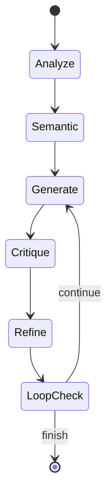

# AI Documentation Agent 🤖📝

**Version 2.0.0** · An intelligent, self-improving AI agent that autonomously generates, critiques, and refines technical documentation for code projects using iterative improvement cycles with semantic code analysis.

[](https://www.python.org/downloads/)
[](https://opensource.org/licenses/MIT)
[](https://deepak-sekarbabu.github.io/ai-doc-agent/)

## ✨ Features

- 🔄 **Iterative Self-Refinement** - AI critiques and improves its own output
- 🧠 **Semantic Code Analysis** - Advanced code relationship and architecture analysis
- 🤖 **Powered by Ollama** - Uses local or cloud LLM for intelligent analysis
- 📊 **Multi-Format Output** - Markdown, HTML, and PDF support
- 🎯 **Smart File Prioritization** - Automatically identifies important files
- 🔍 **Auto-Detection** - Detects project type (frontend/backend/mixed)
- ✅ **Production Ready** - Logging, retries, validation, error handling
- 📝 **Docstring Extraction** - Incorporates existing code documentation
- 🚀 **Response Caching** - Speeds up repeated runs with intelligent caching
- 🏗️ **Architecture Recognition** - Identifies design patterns and dependencies
- 📈 **LangGraph Integration** - State-of-the-art agent orchestration

## 🚀 Quick Start

```bash
# 1️⃣ Clone the repository
git clone https://github.com/deepak-sekarbabu/ai-doc-agent.git
cd ai-doc-agent

# 2️⃣ Create a virtual environment & install the package (dev extras install test, lint, etc.)
python -m venv .venv
source .venv/bin/activate      # Windows: .venv\\Scripts\\activate
pip install -e .[dev]          # -e -> editable install; registers the `ai-doc-agent` console script

# 3️⃣ Run the tool on a sample project (defaults to markdown output)
ai-doc-agent --directory ./examples
```

That's all – you now have a **Markdown** documentation file generated in the current working directory.
Replace the flags in step 3 to change `--output-format`, `--max-files`, `--max-iterations`, etc. (see **Usage** section for the full CLI reference).

## 📁 Project Structure

```
src/
│   ├── langgraph_agent.py     # LangGraph-based AI agent (default)
│   ├── ai_agent.py           # Original AI agent with manual critique loop
│   ├── base_agent.py         # Base agent class
│   ├── doc_generator.py      # Core documentation utilities
│   ├── utils/                # Utility functions
│   │   ├── api_utils.py      # Ollama API integration
│   │   ├── file_utils.py     # File discovery and processing
│   │   ├── text_utils.py     # Text processing utilities
│   │   ├── semantic_code_analyzer.py  # Code relationship analysis
│   │   └── semantic_critique.py       # Documentation critique analysis
│   └── __init__.py        # Package initialization
├── config/                   # Configuration files
│   ├── .env.example         # Environment template
│   └── requirements.txt     # Python dependencies
├── docs/                     # MkDocs documentation
├── build/                  # Build & deployment scripts
│   ├── build.bat/.sh      # Build executables
│   ├── ai_agent.spec      # PyInstaller config
│   ├── Dockerfile         # Container definition
│   └── docker-compose.yml # Docker Compose config
├── examples/              # Sample projects for testing
├── tests/                 # Unit tests
├── output/                # Generated documentation
├── run.py                 # Quick launcher
├── setup.py                  # Package configuration
├── mkdocs.yml               # Documentation site config
└── README.md                # This file
```

See [PROJECT_STRUCTURE.md](PROJECT_STRUCTURE.md) for details.

## 📖 Usage

The primary entry‑point is the **`ai-doc-agent`** console script.

```bash
ai-doc-agent --directory <path> [options]
```

### CLI Options

| Flag | Description | Default |
|------|-------------|---------|
| `--directory` | Path to the codebase root (required). | – |
| `--output-format` | `markdown` | `html` | `pdf`. | `markdown` |
| `--project-type` | `frontend` | `backend` | `mixed`. Auto‑detect if omitted. | auto |
| `--max-files` | Upper bound on files to analyse. | `100` |
| `--max-iterations` | Maximum critique‑refine cycles. | `3` |
| `--log-level` | Overrides `LOG_LEVEL` for this run. | inherits env |
| `--no-cache` | Disables `ResponseCache` for the current execution. | `False` |
| `--output-dir` | Directory where the final documentation file will be placed. | Current working directory |
| `-h, --help` | Show the help message and exit. | – |

### Example Workflow

```bash
# Generate HTML documentation for a backend repo,
# limit processing to 50 files, run a maximum of 2 refinement iterations.
ai-doc-agent \
  --directory ./my-service \
  --output-format html \
  --project-type backend \
    --max-files 50 \
    --max-iterations 2
```

The command performs the following steps automatically:

1. **File discovery** – `find_code_files()` respects `max_files` and prioritises key files.
2. **Semantic analysis** – builds a cross‑file dependency graph (via `SemanticCodeAnalyzer`).
3. **Draft generation** – creates a Markdown document via Ollama.
4. **Critique** – LLM feedback is analysed semantically and cross‑validated.
5. **Refinement** – the draft is improved based on the critique.
6. **Loop check** – repeats steps 3‑5 until `max_iterations` or the critique score exceeds `CRITIQUE_THRESHOLD`.
7. **Conversion & saving** – final output is written in the requested format (`markdown`, `html`, or `pdf`).

On success the tool prints the **final critique score** and **output path**, then exits with code 0.

## 🔧 Configuration

Create a copy of the example file and edit the values you need:

```dotenv
# -------------------------------------------------
# Core Ollama configuration
# -------------------------------------------------
OLLAMA_MODE=local               # local | cloud
OLLAMA_API_URL=http://localhost:11434/api/generate
MODEL_NAME=gpt-oss:120b-cloud
API_TIMEOUT=300                 # seconds

# -------------------------------------------------
# Retry & caching
# -------------------------------------------------
MAX_RETRIES=3
RETRY_DELAY=2                   # base seconds for exponential back‑off
ENABLE_CACHING=true
CACHE_DIR=.cache
CRITIQUE_THRESHOLD=0.8          # 0.0‑1.0; higher = stricter

# -------------------------------------------------
# Logging
# -------------------------------------------------
LOG_LEVEL=INFO
LOG_FILE=ai_doc.log            # omit for stdout only

# -------------------------------------------------
# Misc
# -------------------------------------------------
MAX_FILES=100
```

```bash
cp .env.example .env
```

## 📦 Installation & Configuration

### Installing the Package (including console‑script registration)

```bash
git clone https://github.com/deepak-sekarbabu/ai-doc-agent.git
cd ai-doc-agent
python -m venv .venv
source .venv/bin/activate   # Windows: .venv\\Scripts\\activate
pip install -e .[dev]       # -e -> editable install; registers the `ai-doc-agent` console script
#   • ai-doc-agent → src/ai_agent.py (main entry)
#   • doc-generator → src/doc_generator.py
```

The `setup.py` entry‑point definition:

```python
entry_points={
    "console_scripts": [
        "ai-doc-agent=ai_agent:main",
        "doc-generator=doc_generator:main",
    ],
},
```

After installation, the commands are available on the PATH of the virtual environment.

### Running with Docker

A minimal Docker image is provided for CI/CD or isolated runs.

**Dockerfile**

```dockerfile
FROM python:3.12-slim

# Install OS‑level deps (wkhtmltopdf)
RUN apt-get update && apt-get install -y wkhtmltopdf && rm -rf /var/lib/apt/lists/*

# Create a non‑root user
RUN groupadd -r app && useradd -r -g app app
WORKDIR /app
COPY . /app

# Install the package (editable not needed)
RUN python -m venv .venv \\
    && . .venv/bin/activate \\
    && pip install -e .[dev]

USER app

ENTRYPOINT ["ai-doc-agent"]
```

**Build & run**

```bash
# Build the image (tag it as you like)
docker build -t ai-doc-agent:latest .

# Run against a local project directory
docker run --rm -v "$(pwd)/my-project:/src/project" \\
    -e OLLAMA_API_URL=http://host.docker.internal:11434/api/generate \\
    ai-doc-agent:latest \\
    --directory /src/project \\
    --output-format pdf
```

All OS‑level dependencies (`wkhtmltopdf`) are baked into the image, so the container works out‑of‑the‑box.

## 🎯 How It Works

The system follows a **modular, layered architecture** where each layer has a single responsibility and communicates via well‑typed data structures.



The diagram highlights **data flow** (files → analysis → LLM → critique → refinement) and clarifies where each component contributes.

### Workflow Steps

1. **File discovery** – `find_code_files()` respects `max_files` and prioritises key files.
2. **Semantic analysis** – builds a cross‑file dependency graph (via `SemanticCodeAnalyzer`).
3. **Draft generation** – creates a Markdown document via Ollama.
4. **Critique** – LLM feedback is analysed semantically and cross‑validated.
5. **Refinement** – the draft is improved based on the critique.
6. **Loop check** – repeats steps 3‑5 until `max_iterations` or the critique score exceeds `CRITIQUE_THRESHOLD`.
7. **Conversion & saving** – final output is written in the requested format (`markdown`, `html`, or `pdf`).

## 📚 Documentation

**📖 [Full Documentation Site](https://deepak-sekarbabu.github.io/ai-doc-agent/)**

### Quick Links

- **[Quick Start Guide](https://deepak-sekarbabu.github.io/ai-doc-agent/getting-started/quickstart/)** - Get started in 5 minutes
- **[User Guide](https://deepak-sekarbabu.github.io/ai-doc-agent/guide/overview/)** - Complete feature overview
- **[Command Reference](https://deepak-sekarbabu.github.io/ai-doc-agent/guide/commands/)** - All CLI options
- **[Configuration](https://deepak-sekarbabu.github.io/ai-doc-agent/getting-started/configuration/)** - Environment setup
- **[API Reference](https://deepak-sekarbabu.github.io/ai-doc-agent/reference/api/)** - Python API docs
- **[Deployment](https://deepak-sekarbabu.github.io/ai-doc-agent/deployment/bundling/)** - Docker, PyInstaller
- **[Examples](https://deepak-sekarbabu.github.io/ai-doc-agent/examples/samples/)** - Sample projects
- **[Troubleshooting](https://deepak-sekarbabu.github.io/ai-doc-agent/examples/troubleshooting/)** - Common issues
- **[Contributing](https://deepak-sekarbabu.github.io/ai-doc-agent/development/contributing/)** - How to contribute

### Local Documentation

View documentation locally:

```bash
# Install MkDocs
pip install mkdocs mkdocs-material

# Serve documentation
mkdocs serve

# Visit http://localhost:8000
```

## 🛠️ Requirements

| Requirement | Minimum version / notes |
|-------------|--------------------------|
| **Python** | 3.8 + (tested up to 3.12) |
| **LangGraph** | 0.2.0 |
| **pdfkit** | 0.6.1 (requires `wkhtmltopdf` binary) |
| **markdown** | 3.4 |
| **requests** | 2.31.0 |
| **python‑dotenv** | 1.0.0 |
| **git**, **curl** | For API testing and CI |

### Core Dependencies

All runtime dependencies are listed in `config/requirements.txt`. The `dev` extra (installed with `pip install -e .[dev]`) adds testing, linting, and type‑checking tools.

### Installing **wkhtmltopdf**

`pdfkit` depends on the external `wkhtmltopdf` binary.

| OS | Command |
|----|---------|
| **Ubuntu / Debian** | `sudo apt-get update && sudo apt-get install -y wkhtmltopdf` |
| **CentOS / RHEL** | `sudo yum install -y wkhtmltopdf` |
| **macOS** (Homebrew) | `brew install wkhtmltopdf` |
| **Windows** | Download the installer from the official site: <https://github.com/wkhtmltopdf/wkhtmltopdf/releases/latest> (choose the `*.exe`). Add the install folder to `PATH`. |

> **Tip:** Verify with `wkhtmltopdf --version`. Must be **≥ 0.12.6**.

### Supported Languages & File Extensions

| Language | File extensions |
|----------|-----------------|
| Python | `.py` |
| JavaScript / TypeScript | `.js`, `.ts`, `.tsx`, `.jsx` |
| Java | `.java` |
| C# | `.cs` |
| Go | `.go` |
| PHP | `.php` |
| Ruby | `.rb` |
| Rust | `.rs` |
| C / C++ | `.c`, `.cpp`, `.h`, `.hpp` |
| Kotlin | `.kt` |
| Swift | `.swift` |
| SQL | `.sql` |
| Shell | `.sh` |
| HTML / CSS / SCSS | `.html`, `.css`, `.scss` |
| Vue / Svelte | `.vue`, `.svelte` |
| XML / Gradle | `.xml`, `.gradle` |

These extensions are defined in `src/utils/file_utils.py` under `SUPPORTED_EXTENSIONS`. Languages **not** listed (e.g., **Rust, Go, etc.**) are currently unsupported for semantic analysis; see **Section 7.2** for guidance on adding new parsers.

## 🔥 Example Output

The agent generates comprehensive documentation including:

1. **Project Overview** - Purpose, technologies, use cases
2. **Architecture & Design** - Component structure, patterns, organization
3. **Key Components** - Detailed module documentation with semantic relationships
4. **Development Setup** - Installation, configuration, commands
5. **Deployment Guide** - Build process, hosting options
6. **File Documentation** - Functions, classes, methods with examples
7. **Best Practices** - Coding standards, security, performance
8. **Semantic Analysis** - Code relationships, dependencies, and architectural patterns

## 🧪 Testing

### Running Tests & Coverage

```bash
pytest                # run all tests
pytest -k semantic    # only semantic‑related tests
pytest --cov=src --cov-report=term-missing
```

### CI Integration Example

```yaml
name: CI
on: [push, pull_request]

jobs:
  test:
    runs-on: ubuntu-latest
    steps:
      - uses: actions/checkout@v3
      - name: Set up Python
        uses: actions/setup-python@v4
        with:
          python-version: "3.11"
      - name: Install dependencies
        run: |
          python -m venv .venv
          source .venv/bin/activate
          pip install -e .[dev]
      - name: Run tests with coverage
        run: |
          source .venv/bin/activate
          pytest --cov=src --cov-report=xml
      - name: Upload coverage to Codecov
        uses: codecov/codecov-action@v3
```

### Coverage Policy

The project enforces a minimum **85 %** total statement coverage. CI will fail if the threshold is not met:

```bash
pytest --cov=src --cov-fail-under=85
```

## 🔒 Security Considerations

* **Data confidentiality** – By default the agent sends code snippets to the *local* Ollama server (`OLLAMA_MODE=local`). If you switch to a cloud endpoint, be aware that proprietary code will be transmitted to an external service.
* **Environment secret handling** – Keep `.env` files out of version control (`gitignore` includes `.env`).
* **Timeouts** – `API_TIMEOUT` (default 300 s) prevents hanging requests that could be exploited for denial‑of‑service.
* **Least‑privilege execution** – Run the tool in a container or a non‑root user when processing untrusted repositories.

## ❓ FAQ & Common Pitfalls

| Question | Answer |
|----------|--------|
| **The LLM returns an empty response.** | Verify `OLLAMA_API_URL` points to a running server and that `MODEL_NAME` is correct. Test connectivity with `curl $OLLAMA_API_URL`. |
| **Cache directory not writable.** | Set `CACHE_DIR` to a path you own or disable caching via `--no-cache`. The `ResponseCache` creates the directory automatically if it does not exist. |
| **PDF generation fails with "wkhtmltopdf not found".** | Install `wkhtmltopdf` as described in **Section 4.2** and ensure the binary is on the `PATH`. On Windows, restart the terminal after installation. |
| **The agent never stops iterating.** | Check `CRITIQUE_THRESHOLD`. A very high value (e.g., > 0.95) may never be reached. Lower the threshold or increase `MAX_ITERATIONS` to bound the loop. |
| **My project uses a language not listed (e.g., Rust).** | See **Section 7.2** for instructions on adding a new parser and updating `SUPPORTED_EXTENSIONS`. |
| **I need a different output format (DOCX, ePub).** | Follow the pattern in **Section 7.1** – implement a converter function and add it to `OUTPUT_CONVERTERS`. |
| **CI fails because coverage is below 85 %.** | Run `pytest --cov=src` locally, add missing tests, or lower the threshold if acceptable. |
| **How do I gracefully stop a long‑running run?** | Press `Ctrl‑C`; the agent catches `KeyboardInterrupt`, flushes logs, and exits with code 130. |

## ⚡ Performance Tips

1. **Start Small** - Use `--max-files 20` for initial testing
2. **Choose Right Model** - Larger = better quality but slower
3. **Adjust Iterations** - More iterations = better quality but longer
4. **Specify Type** - Use `--project-type` to skip auto-detection
5. **Monitor Logs** - Check `ai_agent.log` for insights

## 🐛 Troubleshooting

### Common Issues

**Cannot connect to Ollama:**
```bash
# For Local Ollama
ollama serve
# Check your .env configuration
OLLAMA_MODE=local
MODEL_NAME=llama2:7b

# For Cloud Ollama
OLLAMA_MODE=cloud
MODEL_NAME=gpt-oss:120b-cloud
```

**PDF generation fails:**
```bash
# Install wkhtmltopdf (see Requirements section)
# Ubuntu/Debian: sudo apt-get install wkhtmltopdf
# macOS: brew install wkhtmltopdf
# Windows: Download from https://wkhtmltopdf.org/downloads.html

# Verify installation
wkhtmltopdf --version
```

**Poor quality output:**
```bash
# Increase refinement iterations
ai-doc-agent --directory ./project --max-iterations 5

# Use a better model
ai-doc-agent --directory ./project --model codellama

# Analyze more files for better context
ai-doc-agent --directory ./project --max-files 50
```

**Semantic analysis not working:**
```bash
# Check if language is supported (see Requirements)
# For unsupported languages, only basic analysis is performed
ai-doc-agent --directory ./project --verbose
```

## 🤝 Contributing

Contributions are welcome! Please read our [Contributing Guide](https://deepak-sekarbabu.github.io/ai-doc-agent/development/contributing/) for details on:

- Development setup
- Coding standards
- Testing guidelines
- Pull request process
- Code of conduct

The organized structure makes it easy:

- **Add features** in `src/`
- **Add tests** in `tests/` (required for CI/CD)
- **Update docs** in `docs/`
- **Add examples** in `examples/`

### Code Quality Requirements

All contributions must pass:
- **Tests**: `pytest` with >80% coverage
- **Linting**: `black` formatting and `flake8` checks
- **Type Checking**: `mypy` validation
- **CI/CD**: GitHub Actions workflow

See [Testing Guide](https://deepak-sekarbabu.github.io/ai-doc-agent/development/testing/) for testing instructions.

## 📄 License

MIT License - see LICENSE file for details

## 🙏 Acknowledgments

Built with:
- [Ollama](https://ollama.ai/) - Local LLM inference
- [LangChain](https://www.langchain.com/) & [LangGraph](https://langchain-ai.github.io/langgraph/) - AI agent framework
- [PyInstaller](https://pyinstaller.org/) - Executable bundling
- [Docker](https://www.docker.com/) - Containerization

## 📧 Support

- 📖 **Documentation**: [Full Docs Site](https://deepak-sekarbabu.github.io/ai-doc-agent/)
- 🐛 **Issues**: [GitHub Issues](https://github.com/deepak-sekarbabu/ai-doc-agent/issues)
- 💬 **Discussions**: [GitHub Discussions](https://github.com/deepak-sekarbabu/ai-doc-agent/discussions)
- 📝 **Troubleshooting**: Check `ai_agent.log` with `--verbose` flag
- 🔧 **Common Issues**: [Troubleshooting Guide](https://deepak-sekarbabu.github.io/ai-doc-agent/examples/troubleshooting/)

## 🚦 Status

- ✅ Core Features - Complete
- ✅ Documentation - Complete
- ✅ Bundling Options - Complete
- ✅ Unit Tests - Complete
- ✅ CI/CD Pipeline - Complete

---

**Quick Links:**
[📖 Documentation](https://deepak-sekarbabu.github.io/ai-doc-agent/) • 
[🚀 Quick Start](https://deepak-sekarbabu.github.io/ai-doc-agent/getting-started/quickstart/) • 
[🎁 Deployment](https://deepak-sekarbabu.github.io/ai-doc-agent/deployment/bundling/) • 
[📁 API Reference](https://deepak-sekarbabu.github.io/ai-doc-agent/reference/api/) • 
[🧪 Examples](https://deepak-sekarbabu.github.io/ai-doc-agent/examples/samples/) • 
[🐛 Troubleshooting](https://deepak-sekarbabu.github.io/ai-doc-agent/examples/troubleshooting/)

Made with ❤️ using AI-powered development
