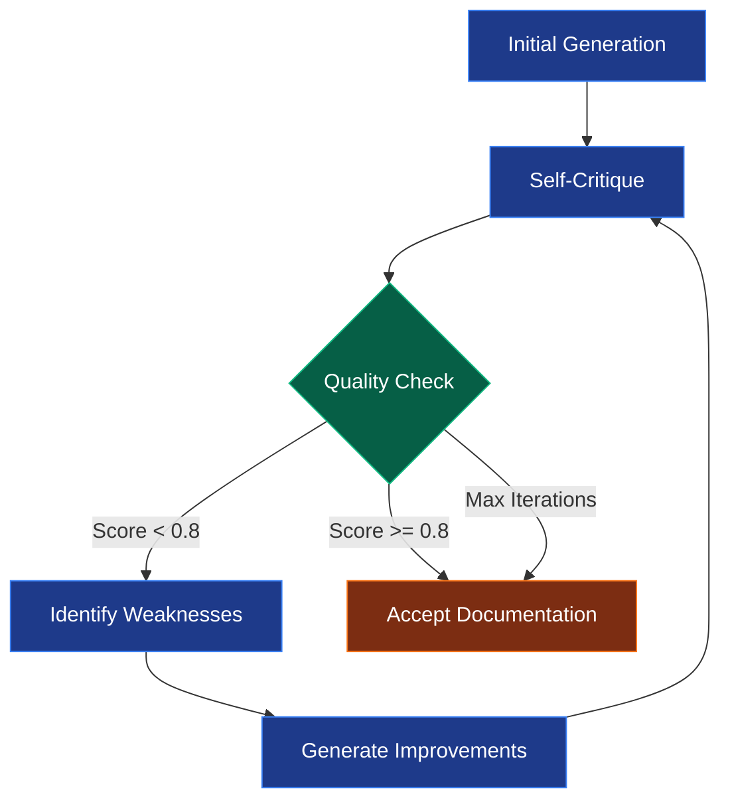

# Iterative Refinement

The cornerstone feature of AI Documentation Agent - autonomous quality improvement through self-critique and refinement cycles.

## Overview

Unlike traditional documentation generators that produce a single output, the AI Agent continuously improves its documentation through multiple iterations, critiquing and refining its own work until quality standards are met.

## How It Works



## The Refinement Cycle

### Iteration 1: Initial Generation

**Input:** Raw codebase files  
**Output:** First documentation draft

```markdown
# Project Documentation

## Overview
This is a web application.

## Files
- app.py - Main application
- utils.py - Utilities

## Setup
Run: python app.py
```

**Critique:**

- ❌ Missing architecture explanation
- ❌ No deployment instructions
- ❌ Unclear component relationships
- ❌ Insufficient examples

**Score:** 0.45 / 1.0

---

### Iteration 2: First Refinement

**Input:** Critique feedback + original draft  
**Output:** Improved documentation

```markdown
# Project Documentation

## Overview
A Flask-based web application providing REST API endpoints
for data management with SQLite backend.

## Architecture
- Frontend: React (port 3000)
- Backend: Flask API (port 5000)
- Database: SQLite

## Key Components
### app.py
Main Flask application defining routes:
- GET /api/users - List users
- POST /api/users - Create user

### utils.py
Helper functions for data validation and formatting.

## Setup
1. Install: pip install -r requirements.txt
2. Run: python app.py
3. Access: http://localhost:5000
```

**Critique:**

- ✅ Architecture explained
- ✅ Component purposes clear
- ⚠️ Still missing deployment guide
- ⚠️ No code examples

**Score:** 0.72 / 1.0

---

### Iteration 3: Second Refinement

**Input:** Critique feedback + refined draft  
**Output:** High-quality documentation

```markdown
# Project Documentation

## Overview
A modern Flask-based REST API application providing user
management capabilities with SQLite persistence, designed
for deployment on cloud platforms or local servers.

## Architecture
### System Design
- **Frontend Layer**: React SPA (port 3000)
- **API Layer**: Flask REST API (port 5000)
- **Data Layer**: SQLite database

### Component Relationships
```

React UI → Flask API → SQLite DB
          ↓
       utils.py (validation)

```

## Key Components

### app.py - Main Application
Flask application with REST endpoints:

```python
@app.route('/api/users', methods=['GET'])
def get_users():
    """Retrieve all users from database"""
    return jsonify(User.query.all())
```

**Endpoints:**

- `GET /api/users` - List all users
- `POST /api/users` - Create new user
- `PUT /api/users/:id` - Update user
- `DELETE /api/users/:id` - Delete user

### utils.py - Utility Functions

Data validation and formatting helpers:

```python
def validate_email(email):
    """Validate email format using regex"""
    return re.match(r'^[\w\.-]+@[\w\.-]+$', email)
```

## Development Setup

### Prerequisites

- Python 3.8+
- pip
- Node.js 16+ (for frontend)

### Installation

```bash
# Backend
pip install -r requirements.txt

# Frontend
cd frontend && npm install
```

### Running Locally

```bash
# Start backend
python app.py

# Start frontend (separate terminal)
cd frontend && npm start
```

## Deployment

### Production Build

```bash
# Build frontend
cd frontend && npm run build

# Set environment
export FLASK_ENV=production

# Run with gunicorn
gunicorn -w 4 app:app
```

### Cloud Deployment

- **Heroku**: `git push heroku main`
- **AWS**: Deploy via Elastic Beanstalk
- **Docker**: `docker build -t myapp .`

## Best Practices

- Always validate input data
- Use environment variables for config
- Enable CORS for production
- Implement proper error handling

```

**Critique:**
- ✅ Comprehensive coverage
- ✅ Clear examples provided
- ✅ Deployment instructions included
- ✅ Best practices documented
- ✅ Well-structured and organized

**Score:** 0.92 / 1.0

**Result:** ✅ **ACCEPTED**

## Key Benefits

### 1. Autonomous Quality Improvement

No human intervention needed - the agent identifies and fixes its own mistakes.

**Before Refinement:**
```

"This file handles users."

```

**After Refinement:**
```

"UserController manages user authentication, profile updates,
and session management. Implements JWT-based authentication
with Redis session storage. See example usage below..."

```

### 2. Comprehensive Coverage

Each iteration addresses gaps identified in the critique.

**Iteration 1 might miss:**
- Deployment instructions
- Architecture diagrams
- Code examples
- Best practices

**Iteration 3+ ensures:**
- ✅ Complete deployment guide
- ✅ Architecture explanation
- ✅ Working code examples
- ✅ Security best practices

### 3. Consistent Quality

Quality threshold ensures minimum standards are met.

**Configurable threshold:**
```bash
# In .env
CRITIQUE_THRESHOLD=0.8  # Accepts docs scoring >= 80%
```

**Quality criteria:**

- Completeness (all sections present)
- Clarity (easy to understand)
- Accuracy (technically correct)
- Examples (code samples provided)
- Organization (logical structure)

### 4. Adaptive Learning

Agent learns from its mistakes within each run.

```
Iteration 1: Misses deployment → Critique identifies gap
Iteration 2: Adds basic deployment → Critique wants more detail
Iteration 3: Comprehensive deployment guide → Accepted
```

## Configuration

Control refinement behavior through settings and command options.

### Environment Variables

```bash
# Quality threshold (0.0-1.0)
CRITIQUE_THRESHOLD=0.8

# Higher = stricter quality requirements
CRITIQUE_THRESHOLD=0.9

# Lower = accept sooner (faster but lower quality)
CRITIQUE_THRESHOLD=0.7
```

### Command Options

```bash
# Maximum iterations (default: 3)
python run.py --iterations 3

# Quick docs (fewer iterations)
python run.py --iterations 2

# Maximum quality (more iterations)
python run.py --iterations 5

# Single pass (no refinement)
python run.py --iterations 1
```

## Iteration Strategies

### Fast Strategy (2 iterations)

**Best for:**

- Quick documentation needs
- Small projects
- Initial drafts
- Testing

```bash
python run.py --iterations 2 --max-files 20
```

**Time:** ~2-3 minutes  
**Quality:** ⭐⭐⭐

---

### Balanced Strategy (3 iterations)

**Best for:**

- Most projects
- Standard quality needs
- Production documentation
- Regular use

```bash
python run.py --iterations 3
```

**Time:** ~5-7 minutes  
**Quality:** ⭐⭐⭐⭐

---

### High-Quality Strategy (5 iterations)

**Best for:**

- Critical documentation
- Complex projects
- Client deliverables
- Public documentation

```bash
python run.py --iterations 5 --max-files 100
```

**Time:** ~10-15 minutes  
**Quality:** ⭐⭐⭐⭐⭐

---

### Maximum Quality Strategy (7-10 iterations)

**Best for:**

- Mission-critical docs
- Large enterprise projects
- API documentation
- Comprehensive coverage

```bash
python run.py --iterations 10 --max-files 200 --model codellama
```

**Time:** ~20-30 minutes  
**Quality:** ⭐⭐⭐⭐⭐ (Exceptional)

## Monitoring Refinement

### Verbose Mode

See the refinement process in real-time:

```bash
python run.py --verbose
```

**Output:**

```
INFO - Iteration 1/3 - Generating initial documentation...
INFO - Iteration 1/3 - Critiquing documentation...
DEBUG - Critique: Missing deployment section
DEBUG - Critique: Need more code examples
DEBUG - Quality score: 0.65 (threshold: 0.8)
INFO - Iteration 2/3 - Refining documentation...
INFO - Iteration 2/3 - Critiquing documentation...
DEBUG - Critique: Good improvement, minor enhancements needed
DEBUG - Quality score: 0.78 (threshold: 0.8)
INFO - Iteration 3/3 - Refining documentation...
INFO - Iteration 3/3 - Critiquing documentation...
DEBUG - Critique: Excellent quality
DEBUG - Quality score: 0.89 (threshold: 0.8)
INFO - Documentation accepted!
```

### Log Files

Detailed refinement tracking in `langgraph_agent.log`:

```
2025-01-26 10:15:23 - langgraph_agent - INFO - Starting refinement cycle
2025-01-26 10:15:45 - langgraph_agent - DEBUG - Iteration 1 critique score: 0.65
2025-01-26 10:16:12 - langgraph_agent - DEBUG - Iteration 2 critique score: 0.78
2025-01-26 10:16:38 - langgraph_agent - DEBUG - Iteration 3 critique score: 0.89
2025-01-26 10:16:38 - langgraph_agent - INFO - Quality threshold met, accepting
```

## Performance Considerations

### Iteration vs. Quality Trade-off

| Iterations | Time | Quality | Best For |
|------------|------|---------|----------|
| 1 | 1-2 min | ⭐⭐ | Testing only |
| 2 | 2-3 min | ⭐⭐⭐ | Quick needs |
| 3 | 5-7 min | ⭐⭐⭐⭐ | Most projects |
| 5 | 10-15 min | ⭐⭐⭐⭐⭐ | Important docs |
| 10 | 20-30 min | ⭐⭐⭐⭐⭐ | Critical/Large |

### API Cost Optimization

Each iteration makes API calls:

**Typical API calls per iteration:**

- 1 generation/refinement call
- 1 critique call
- Total: 2 calls per iteration

**Example:**

- 3 iterations = ~6 API calls
- 5 iterations = ~10 API calls
- 10 iterations = ~20 API calls

**Optimization tips:**

```bash
# Use local Ollama to avoid API costs
OLLAMA_API_URL=http://localhost:11434/api/generate

# Reduce iterations for less critical docs
python run.py --iterations 2

# Balance files vs iterations
python run.py --max-files 30 --iterations 3  # Good balance
```

## Best Practices

### 1. Start Conservative

```bash
# First run - use defaults
python run.py

# Evaluate output quality
# Then adjust if needed
```

### 2. Match Iterations to Importance

```bash
# Internal docs
python run.py --iterations 2

# Team documentation
python run.py --iterations 3

# Client deliverables
python run.py --iterations 5

# Public/Open source
python run.py --iterations 7
```

### 3. Monitor First Iteration

```bash
# Use verbose to see initial quality
python run.py --verbose --iterations 3

# If iteration 1 score is high (>0.8), reduce iterations
# If iteration 1 score is low (<0.5), increase iterations
```

### 4. Combine with Other Features

```bash
# Quality docs for large projects
python run.py \
  --iterations 5 \
  --max-files 100 \
  --model codellama \
  --project-type backend
```

## Troubleshooting

### Low Quality After Max Iterations

**Symptom:** Quality score never reaches threshold

**Causes:**

- Insufficient file context
- Model not powerful enough
- Threshold too high
- Complex codebase

**Solutions:**

```bash
# Increase files for more context
python run.py --max-files 75

# Use better model
python run.py --model codellama

# Lower threshold temporarily
# In .env: CRITIQUE_THRESHOLD=0.7

# Increase iterations
python run.py --iterations 7
```

### Slow Refinement

**Symptom:** Each iteration takes very long

**Solutions:**

```bash
# Use faster model
python run.py --model llama2:7b

# Reduce files
python run.py --max-files 20

# Increase timeout
# In .env: API_TIMEOUT=600
```

### Diminishing Returns

**Symptom:** Later iterations show little improvement

**Solutions:**

```bash
# Reduce max iterations
python run.py --iterations 3

# You've reached quality plateau
# Current iterations are sufficient
```

## Comparison: With vs Without Refinement

### Without Refinement (Simple Generator)

```bash
python src/doc_generator.py ./my-project
```

**Time:** 1 minute  
**Quality:** ⭐⭐  
**Coverage:** Basic  
**Examples:** Few or none  
**Deployment:** Often missing

---

### With Refinement (AI Agent, 3 iterations)

```bash
python run.py --iterations 3
```

**Time:** 5 minutes  
**Quality:** ⭐⭐⭐⭐  
**Coverage:** Comprehensive  
**Examples:** Multiple examples  
**Deployment:** Complete guide

---

### Quality Difference Example

**Without refinement:**

```
## Authentication
The app has authentication. Uses JWT tokens.
```

**With refinement:**

```
## Authentication System

### Overview
JWT-based authentication with refresh token rotation
and Redis session management.

### Implementation
```python
@app.route('/auth/login', methods=['POST'])
def login():
    """
    Authenticate user and issue JWT tokens.
    
    Request:
        {
            "email": "user@example.com",
            "password": "secure_password"
        }
    
    Returns:
        {
            "access_token": "eyJ...",
            "refresh_token": "eyJ...",
            "expires_in": 3600
        }
    """
    # Implementation...
```

### Security Features

- Bcrypt password hashing
- Token rotation every 15 minutes
- Redis-based session invalidation
- Rate limiting: 5 attempts per minute

### Usage Example

```javascript
const response = await fetch('/auth/login', {
    method: 'POST',
    headers: {'Content-Type': 'application/json'},
    body: JSON.stringify({email, password})
});
```

```

## Next Steps

- [Project Detection](project-detection.md) - Auto-detect project types
- [Multi-Format Output](output-formats.md) - Generate in various formats
- [AI Agent Guide](../guide/ai-agent.md) - Complete usage guide
- [Configuration](../getting-started/configuration.md) - Customize refinement
