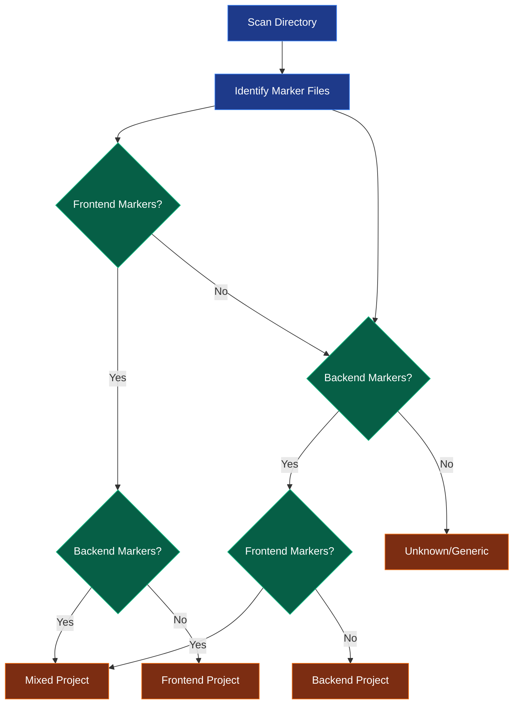

# Project Detection

Intelligent automatic detection of project type with smart file prioritization for optimal documentation quality.

## Overview

The AI Documentation Agent automatically analyzes your codebase to determine whether it's a frontend, backend, or mixed (full-stack) project. This detection drives smart file prioritization, ensuring the most important files are analyzed first.

## How Detection Works



## Detection Criteria

### Frontend Project Indicators

**Primary Markers:**
- `package.json` - Node.js package file
- `yarn.lock` - Yarn dependency lock
- `pnpm-lock.yaml` - PNPM dependency lock
- `package-lock.json` - NPM dependency lock

**Framework Indicators:**
- `.jsx`, `.tsx` files - React components
- `.vue` files - Vue.js components
- `.svelte` files - Svelte components
- `.angular.ts` - Angular components

**Configuration Files:**
- `webpack.config.js` - Webpack bundler
- `vite.config.ts` - Vite bundler
- `rollup.config.js` - Rollup bundler
- `next.config.js` - Next.js
- `nuxt.config.js` - Nuxt.js
- `tailwind.config.js` - Tailwind CSS

**Example Frontend Structure:**
```
my-app/
├── package.json          ← Frontend marker
├── src/
│   ├── App.tsx          ← React component
│   ├── components/
│   └── index.tsx
├── vite.config.ts       ← Build config
└── tailwind.config.js   ← Styling config

→ Detected as: FRONTEND
```

---

### Backend Project Indicators

**Python:**
- `requirements.txt` - Python dependencies
- `Pipfile` - Pipenv config
- `pyproject.toml` - Poetry config
- `setup.py` - Package setup

**Java:**
- `pom.xml` - Maven project
- `build.gradle` - Gradle project
- `.gradle` directory

**Go:**
- `go.mod` - Go modules
- `go.sum` - Go checksums

**Rust:**
- `Cargo.toml` - Cargo manifest
- `Cargo.lock` - Dependency lock

**Node.js Backend:**
- `package.json` with `express`, `fastify`, `koa`
- No frontend framework files

**Other:**
- `Gemfile` - Ruby
- `composer.json` - PHP
- `.csproj` - C# project
- `Program.cs` - .NET entry point

**Example Backend Structure:**
```
api-server/
├── requirements.txt     ← Python backend
├── app/
│   ├── main.py         ← Flask/FastAPI
│   ├── models.py
│   └── routes.py
├── tests/
└── README.md

→ Detected as: BACKEND
```

---

### Mixed (Full-Stack) Project

Combination of frontend and backend indicators.

**Example Mixed Structure:**
```
fullstack-app/
├── frontend/
│   ├── package.json    ← Frontend
│   └── src/
├── backend/
│   ├── requirements.txt ← Backend
│   └── app/
└── README.md

→ Detected as: MIXED
```

## File Prioritization

Once project type is detected, files are prioritized for analysis.

### Frontend Prioritization

**Tier 1 (Highest Priority):**
```
package.json           # Dependencies and scripts
index.html            # Entry HTML
App.tsx / App.jsx     # Main component
main.tsx / index.tsx  # Entry point
```

**Tier 2 (High Priority):**
```
vite.config.ts        # Build configuration
webpack.config.js
tailwind.config.ts    # Styling config
tsconfig.json         # TypeScript config
```

**Tier 3 (Medium Priority):**
```
src/components/*      # React/Vue components
src/pages/*          # Page components
src/layouts/*        # Layout components
src/hooks/*          # Custom hooks
```

**Tier 4 (Lower Priority):**
```
src/utils/*          # Utility functions
src/styles/*         # Style files
src/types/*          # Type definitions
```

### Backend Prioritization

**Tier 1 (Highest Priority):**
```
# Python
requirements.txt
setup.py
app.py / main.py
wsgi.py

# Java
pom.xml
build.gradle
Application.java
application.properties

# Go
go.mod
main.go

# Rust
Cargo.toml
main.rs

# .NET
Program.cs
Startup.cs
*.csproj
```

**Tier 2 (High Priority):**
```
# Python
models.py
views.py / routes.py
serializers.py
settings.py

# Java
*Controller.java
*Service.java
*Repository.java

# Go
*_handler.go
*_service.go
```

**Tier 3 (Medium Priority):**
```
# Python
utils.py
helpers.py
middleware.py

# Java
*Util.java
*Helper.java
*Config.java
```

**Tier 4 (Lower Priority):**
```
Test files (*_test.py, *Test.java)
Migration files
Static assets
Documentation files
```

### Mixed Project Prioritization

Combines both frontend and backend prioritization strategies:

**Analysis Order:**
1. Root-level config files
2. Backend entry points
3. Frontend entry points
4. Backend core modules
5. Frontend components
6. Utilities and helpers
7. Tests and documentation

## Manual Override

You can override auto-detection:

```bash
# Force frontend detection
python run.py --project-type frontend

# Force backend detection
python run.py --project-type backend

# Force mixed detection
python run.py --project-type mixed
```

**When to override:**
- Auto-detection is incorrect
- Want specific prioritization
- Ambiguous project structure
- Testing documentation approaches

## Benefits of Detection

### 1. Better Context

Analyzing the right files first provides better context for documentation.

**Example - Frontend Project:**
```
Analyzing package.json first reveals:
- Project dependencies
- Available scripts
- Framework used
- Build tools

This context improves documentation of:
- Component files
- Configuration files
- Build process
```

### 2. Improved Quality

Priority files contain architectural information critical for high-quality docs.

**Without Prioritization:**
```
Analyzes random 30 files:
- 10 utility files
- 15 component files
- 5 test files
→ Missing architecture context
```

**With Prioritization:**
```
Analyzes important 30 files:
- 5 config/entry files
- 15 core modules
- 10 key components
→ Complete architecture understanding
```

### 3. Efficient Analysis

Focus on important files when file limit is set.

```bash
# Only 30 files max
python run.py --max-files 30

# Without detection: Random 30 files
# With detection: 30 most important files
```

### 4. Targeted Documentation

Documentation style matches project type.

**Frontend Documentation Includes:**
- Component architecture
- State management
- Routing structure
- Build and deployment
- Styling approach

**Backend Documentation Includes:**
- API endpoints
- Database models
- Authentication/authorization
- Business logic
- Deployment configuration

## Detection Examples

### Example 1: React SPA

**Project Structure:**
```
my-react-app/
├── package.json
├── vite.config.ts
├── index.html
├── src/
│   ├── App.tsx
│   ├── main.tsx
│   └── components/
├── tailwind.config.js
└── tsconfig.json
```

**Detection Result:**
```
Project Type: FRONTEND
Framework: React + Vite
Priority Files:
  1. package.json
  2. index.html
  3. App.tsx
  4. main.tsx
  5. vite.config.ts
  6. tailwind.config.js
```

---

### Example 2: Flask API

**Project Structure:**
```
flask-api/
├── requirements.txt
├── app/
│   ├── __init__.py
│   ├── main.py
│   ├── models.py
│   └── routes/
├── config.py
└── wsgi.py
```

**Detection Result:**
```
Project Type: BACKEND
Framework: Python/Flask
Priority Files:
  1. requirements.txt
  2. app/main.py
  3. wsgi.py
  4. config.py
  5. app/models.py
  6. app/routes/*.py
```

---

### Example 3: Full-Stack MERN

**Project Structure:**
```
mern-app/
├── client/              # React frontend
│   ├── package.json
│   └── src/
├── server/              # Express backend
│   ├── package.json
│   ├── server.js
│   └── routes/
└── README.md
```

**Detection Result:**
```
Project Type: MIXED
Frameworks: React (frontend) + Express (backend)
Priority Files:
  1. server/package.json
  2. client/package.json
  3. server/server.js
  4. client/src/App.tsx
  5. server/routes/*.js
  6. client/src/components/*
```

---

### Example 4: Spring Boot

**Project Structure:**
```
spring-api/
├── pom.xml
├── src/
│   ├── main/
│   │   ├── java/
│   │   │   └── com/app/
│   │   │       ├── Application.java
│   │   │       ├── controllers/
│   │   │       ├── services/
│   │   │       └── repositories/
│   │   └── resources/
│   │       └── application.properties
│   └── test/
└── README.md
```

**Detection Result:**
```
Project Type: BACKEND
Framework: Java/Spring Boot
Priority Files:
  1. pom.xml
  2. Application.java
  3. application.properties
  4. *Controller.java
  5. *Service.java
  6. *Repository.java
```

## Verification

### Check Detection Result

Enable verbose mode to see detection:

```bash
python run.py --verbose
```

**Output:**
```
INFO - Scanning directory: /home/user/my-app
DEBUG - Found marker: package.json (frontend indicator)
DEBUG - Found marker: vite.config.ts (frontend indicator)
DEBUG - Found files: 45 .tsx files (frontend indicator)
INFO - Detected project type: FRONTEND
DEBUG - Priority files identified: 8
DEBUG - Prioritizing: package.json, App.tsx, main.tsx...
```

### Validate Prioritization

Check which files were analyzed first:

```bash
python run.py --verbose 2>&1 | grep "Analyzing file"
```

**Output:**
```
DEBUG - Analyzing file [1/30]: package.json
DEBUG - Analyzing file [2/30]: index.html
DEBUG - Analyzing file [3/30]: src/App.tsx
DEBUG - Analyzing file [4/30]: src/main.tsx
DEBUG - Analyzing file [5/30]: vite.config.ts
...
```

## Troubleshooting

### Incorrect Detection

**Symptom:** Wrong project type detected

**Solution:**
```bash
# Override with correct type
python run.py --project-type backend

# Check verbose output to understand why
python run.py --verbose
```

### No Priority Files Found

**Symptom:** All files treated equally

**Cause:** Unknown project structure

**Solution:**
```bash
# Manually specify type
python run.py --project-type frontend

# Ensure marker files exist
ls package.json requirements.txt pom.xml
```

### Mixed Detection When Should Be Single

**Symptom:** Detected as mixed but is single-type

**Cause:** Stray marker files (e.g., old package.json in backend project)

**Solution:**
```bash
# Force correct type
python run.py --project-type backend

# Or remove stray files
rm old-frontend-files/package.json
```

## Best Practices

### 1. Trust Auto-Detection

For most projects, auto-detection works well:

```bash
# Let it detect automatically
python run.py --directory ~/my-project
```

### 2. Override for Ambiguous Projects

```bash
# Your project has both but is primarily backend
python run.py --project-type backend
```

### 3. Use Verbose for Validation

```bash
# Verify detection on first run
python run.py --verbose
```

### 4. Organize Project Clearly

**Good Structure (Easy to Detect):**
```
fullstack-app/
├── frontend/          # Clear separation
│   └── package.json
└── backend/
    └── requirements.txt
```

**Unclear Structure (May Confuse):**
```
my-app/
├── package.json       # Frontend or backend?
├── *.py files         # Backend?
└── *.tsx files        # Frontend?
```

## Performance Impact

Detection is fast and efficient:

**Time Cost:**
- Directory scan: <1 second
- Marker detection: <0.1 seconds
- Priority sorting: <0.1 seconds

**Total overhead:** ~1 second (negligible)

**Benefit:** 10-50% quality improvement due to better file selection

## Next Steps

- [Iterative Refinement](iterative-refinement.md) - Quality improvement cycles
- [Multi-Format Output](output-formats.md) - Various output formats
- [AI Agent Guide](../guide/ai-agent.md) - Complete usage guide
- [Command Reference](../guide/commands.md) - All command options
