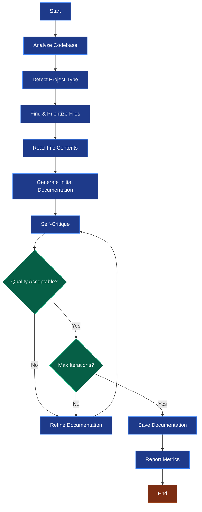

# AI Agent Guide

Complete guide to using the AI Documentation Agent with iterative refinement.

## Overview

The AI Agent (`src/langgraph_agent.py`) is the default implementation of the documentation agent, built using LangGraph. It uses an iterative critique-refine cycle to generate high-quality documentation that improves with each iteration.

> **Note**: This guide covers the LangGraph-based implementation. The project also includes an [original AIAgent implementation](../features/agent-implementations.md) with a different architectural approach.

## How It Works

The AI Agent follows a sophisticated workflow, which is implemented as a stateful graph using LangGraph:



## Key Features

### 1. Iterative Refinement

The agent doesn't settle for the first draft:

**Iteration 1:**
```
Draft → "Basic project structure documented"
Critique → "Missing deployment section, unclear component relationships"
```

**Iteration 2:**
```
Refined → "Added deployment guide, clarified architecture"
Critique → "Good improvement, but examples needed"
```

**Iteration 3:**
```
Refined → "Added code examples and usage patterns"
Critique → "Excellent quality, comprehensive coverage"
→ Accept ✓
```

### 2. Self-Critique

The agent evaluates its own work against quality criteria:

- **Completeness** - All sections covered?
- **Clarity** - Easy to understand?
- **Accuracy** - Technically correct?
- **Organization** - Well-structured?
- **Examples** - Sufficient code samples?
- **Deployment** - Setup instructions clear?

### 3. Smart File Analysis

Prioritizes important files based on project type:

**Frontend Projects:**
```
Priority 1: package.json, index.html, App.tsx
Priority 2: vite.config.ts, webpack.config.js
Priority 3: Component files, utilities
```

**Backend Projects:**
```
Priority 1: pom.xml, requirements.txt, go.mod
Priority 2: application.properties, config files
Priority 3: Controllers, services, models
```

## Usage

### Basic Usage

```bash
# Quick launcher (uses default settings)
python run.py

# Analyze specific project
python run.py --directory ~/my-project

# Custom output name
python run.py --directory ~/my-app --output my_documentation
```


### Command-Line Options

#### Directory Options

```bash
# Analyze current directory
python run.py

# Analyze specific directory (relative)
python run.py --directory ./my-app

# Analyze specific directory (absolute)
python run.py --directory /home/user/projects/my-app
```

#### Model Options

```bash
# Use default model from .env
python run.py

# Override with specific model
python run.py --model codellama

# Fast model for quick docs
python run.py --model llama2:7b

# High-quality model
python run.py --model llama2:13b
```

#### Output Options

```bash
# Default format (Markdown)
python run.py

# HTML output
python run.py --format html

# PDF output (requires wkhtmltopdf)
python run.py --format pdf

# Custom filename
python run.py --output my_project_documentation
```

#### Quality Options

```bash
# Quick documentation (2 iterations)
python run.py --iterations 2 --max-files 20

# Standard quality (default)
python run.py --iterations 3 --max-files 30

# Maximum quality
python run.py --iterations 5 --max-files 100
```

#### Project Type

```bash
# Auto-detect (default)
python run.py

# Explicitly specify frontend
python run.py --project-type frontend

# Explicitly specify backend
python run.py --project-type backend

# Mixed project
python run.py --project-type mixed
```

#### Debugging

```bash
# Enable verbose logging
python run.py --verbose

# Check logs
tail -f ai_agent.log
```

## Configuration

The agent respects all environment variables in `.env`:

### Critical Settings

```bash
# Model selection
MODEL_NAME=codellama

# API endpoint
OLLAMA_API_URL=http://localhost:11434/api/generate

# Timeouts
API_TIMEOUT=300

# Retry behavior
MAX_RETRIES=3
RETRY_DELAY=2

# Quality threshold (0.0-1.0)
CRITIQUE_THRESHOLD=0.8
```

See [Configuration Guide](../getting-started/configuration.md) for details.

## Workflow Examples

### Example 1: Quick Project Documentation

**Goal:** Fast documentation for a small project

```bash
python run.py \
  --directory ./small-app \
  --iterations 2 \
  --max-files 15 \
  --model llama2:7b
```

**Result:** Basic but complete documentation in ~2 minutes

### Example 2: Production-Ready Documentation

**Goal:** Comprehensive, high-quality documentation

```bash
python run.py \
  --directory ~/important-project \
  --iterations 5 \
  --max-files 100 \
  --model codellama \
  --format pdf \
  --output project_documentation \
  --verbose
```

**Result:** Thorough, refined documentation in ~15 minutes

### Example 3: Backend API Documentation

**Goal:** Document REST API with endpoints

```bash
python run.py \
  --directory ./api-server \
  --project-type backend \
  --model codellama \
  --max-files 50 \
  --iterations 4 \
  --format html
```

**Result:** API-focused documentation with endpoints documented

### Example 4: Frontend Component Library

**Goal:** Document React component library

```bash
python run.py \
  --directory ./component-library \
  --project-type frontend \
  --max-files 75 \
  --iterations 4 \
  --format html
```

**Result:** Component-centric documentation with usage examples

## Understanding Agent Behavior

### Iteration Process

Each iteration consists of:

1. **Generate/Refine** - Create or improve documentation
2. **Critique** - AI evaluates the documentation
3. **Decision** - Accept or continue refining

**Console Output:**
```
INFO - Iteration 1/3 - Generating documentation...
INFO - Iteration 1/3 - Critiquing documentation...
INFO - Critique: Missing deployment section. Adding refinement...
INFO - Iteration 2/3 - Refining documentation...
INFO - Iteration 2/3 - Critiquing documentation...
INFO - Critique: Good quality. Minor improvements needed.
INFO - Iteration 3/3 - Refining documentation...
INFO - Iteration 3/3 - Critiquing documentation...
INFO - Critique: Excellent quality. Documentation complete.
INFO - Documentation accepted.
```

### File Selection

**Discovery Process:**
1. Scan directory recursively
2. Filter supported file types
3. Exclude ignored directories
4. Detect project type
5. Prioritize important files
6. Limit to `max-files`

**Priority Scoring:**
```
High Priority (analyzed first):
  - package.json, requirements.txt, pom.xml
  - index.html, App.tsx/jsx, main.py
  - Configuration files

Medium Priority:
  - Core modules and components
  - Services and utilities
  - API routes and controllers

Lower Priority:
  - Test files
  - Utility functions
  - Helper modules
```

### Quality Metrics

The agent tracks:

- **Iterations Used** - How many refinement cycles
- **Files Analyzed** - Number of files processed
- **Generation Time** - Total time spent
- **API Calls Made** - Number of LLM requests
- **Final Quality Score** - Self-assessed quality (0.0-1.0)

## Advanced Features

### Caching (Future)

The agent is designed to cache responses:

```bash
# Enable caching in .env
ENABLE_CACHING=true
```

**Benefits:**
- Faster subsequent runs
- Reduced API calls
- Lower costs
- Consistent results

*Note: Full caching implementation coming soon*

### Custom Prompts

You can customize the prompts by editing `src/langgraph_agent.py`:

```python
def _build_critique_prompt(self, documentation: str) -> str:
    return f"""Your custom critique prompt...
    
    Evaluation criteria:
    1. Your specific requirement
    2. Your quality standard
    3. Your documentation style
    
    {documentation}
    """
```

### Error Recovery

The agent handles errors gracefully:

- **API Timeout** → Retry with exponential backoff
- **Connection Error** → Retry up to MAX_RETRIES
- **File Read Error** → Skip file, continue with others
- **Quality Not Met** → Continue refining or accept at max iterations

## Troubleshooting

### Poor Quality Output

**Symptoms:**
- Documentation lacks detail
- Missing sections
- Unclear explanations

**Solutions:**
```bash
# Increase iterations
python run.py --iterations 5

# Use better model
python run.py --model codellama

# Analyze more files for context
python run.py --max-files 100

# Specify project type
python run.py --project-type backend
```

### Slow Performance

**Symptoms:**
- Takes too long to complete
- Frequent timeouts

**Solutions:**
```bash
# Reduce files
python run.py --max-files 20

# Use faster model
python run.py --model llama2:7b

# Reduce iterations
python run.py --iterations 2

# Increase timeout in .env
API_TIMEOUT=600
```

### API Errors

**Symptoms:**
- Connection refused
- Timeout errors
- Model not found

**Solutions:**
```bash
# Ensure Ollama is running
ollama serve

# Check model is available
ollama list

# Pull required model
ollama pull llama2:7b

# Verify .env configuration
cat .env | grep OLLAMA_API_URL
```

### File Discovery Issues

**Symptoms:**
- No files found
- Important files skipped

**Solutions:**
```bash
# Use verbose mode
python run.py --verbose

# Check directory path
python run.py --directory /absolute/path

# Review ignored directories
# Edit IGNORED_DIRECTORIES in src/doc_generator.py
```

## Best Practices

### 1. Start with Defaults

```bash
# First run - use defaults
python run.py --directory ./my-project
```

Evaluate the output, then adjust settings.

### 2. Choose Appropriate Iterations

- **2 iterations** → Quick docs, small projects
- **3 iterations** → Standard quality, most projects (default)
- **5 iterations** → Maximum quality, important projects

### 3. Match Model to Task

- **llama2:7b** → Fast, good for testing
- **mistral** → Balanced quality/speed
- **codellama** → Best for code documentation
- **llama2:13b** → Maximum quality (slow)

### 4. Monitor and Adjust

```bash
# Enable verbose mode
python run.py --verbose

# Watch logs in real-time
tail -f ai_agent.log
```

### 5. Specify Project Type

Auto-detection is good, but explicit is better:

```bash
python run.py --project-type backend
```

## Performance Tips

### For Speed
```bash
python run.py \
  --model llama2:7b \
  --iterations 2 \
  --max-files 20
```

### For Quality
```bash
python run.py \
  --model codellama \
  --iterations 5 \
  --max-files 100
```

### For Balance
```bash
python run.py \
  --model mistral \
  --iterations 3 \
  --max-files 50
```

## Next Steps

- [Simple Generator Guide](doc-generator.md) - Quick, non-iterative generation
- [Command Reference](commands.md) - Complete command documentation
- [Configuration](../getting-started/configuration.md) - Detailed configuration options
- [Complete Guide](../guide.md) - All features in depth
