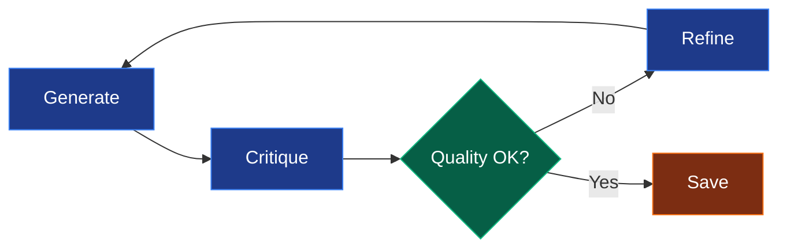

# User Guide Overview

Welcome to the AI Documentation Agent! This guide will help you understand and use all the features of this intelligent documentation tool.

## What is AI Documentation Agent?

An autonomous AI agent that generates, critiques, and iteratively refines technical documentation for your code projects. It analyzes your codebase, understands the structure, and creates comprehensive documentation automatically.

## Key Features

### 🔄 Iterative Self-Refinement

The agent doesn't just generate documentation once—it critiques its own output and improves it through multiple iterations until it meets quality standards.



### 🎯 Smart File Prioritization

Automatically identifies and prioritizes important files based on your project type:

- **Frontend Projects**: `package.json`, `App.tsx`, `index.html`, config files
- **Backend Projects**: `pom.xml`, `requirements.txt`, `go.mod`, main entry points
- **Mixed Projects**: Intelligently combines both strategies

### 🔍 Auto-Detection

Detects your project type automatically:

| Project Type | Indicators |
|--------------|------------|
| **Frontend** | `package.json`, React/Vue/Svelte files, `webpack.config.js` |
| **Backend** | `pom.xml`, `build.gradle`, `requirements.txt`, `go.mod`, `Cargo.toml` |
| **Mixed** | Contains both frontend and backend indicators |

### 📊 Multi-Format Output

Generate documentation in multiple formats:

- **Markdown** - Perfect for GitHub, GitLab, documentation sites
- **HTML** - Styled, professional, browser-ready
- **PDF** - Printable, shareable, professional presentations

### ✅ Production Ready

Built with enterprise needs in mind:

- **Logging** - Comprehensive logging with file and console output
- **Retry Logic** - Exponential backoff for API failures
- **Error Handling** - Graceful degradation and clear error messages
- **Validation** - Input validation and quality checks
- **Configuration** - Flexible environment-based configuration

## How It Works

### 1. Analysis Phase

The agent scans your project directory:

```bash
python run.py --directory ./my-project
```

- Discovers all code files
- Filters out ignored directories (`node_modules`, `.git`, etc.)
- Detects project type
- Prioritizes important files

### 2. Generation Phase

Creates initial documentation draft:

- Analyzes file contents
- Extracts docstrings and comments
- Identifies key components
- Generates structured documentation

### 3. Critique Phase

AI critiques its own work:

- Evaluates completeness
- Checks clarity and organization
- Identifies missing sections
- Assesses quality against standards

### 4. Refinement Phase

Improves based on critique:

- Adds missing information
- Clarifies unclear sections
- Reorganizes for better flow
- Enhances examples and details

### 5. Iteration

Repeats critique and refinement until:

- Quality threshold is met, OR
- Maximum iterations reached

### 6. Output

Saves final documentation:

- Converts to requested format
- Applies styling (for HTML/PDF)
- Saves to output directory
- Reports metrics and statistics

## Two Modes of Operation

### Mode 1: AI Agent (Recommended)

**File:** `src/ai_agent.py`

The full AI agent with iterative refinement:

```bash
python src/ai_agent.py --directory ./my-project --iterations 5
```

**Features:**
- ✅ Iterative refinement
- ✅ Self-critique
- ✅ Quality improvement
- ✅ Multiple iterations
- ✅ Best quality output

**When to use:**
- Production documentation
- Comprehensive project docs
- High-quality requirements
- You have time for multiple iterations

### Mode 2: Simple Generator

**File:** `src/doc_generator.py`

Quick, single-pass documentation:

```bash
python src/doc_generator.py ./my-project
```

**Features:**
- ✅ Fast generation
- ✅ Single pass
- ✅ Basic documentation
- ⚠️ No refinement

**When to use:**
- Quick documentation needs
- Simple projects
- Time-constrained situations
- Initial documentation drafts

## Quick Start Guide

### Basic Usage

```bash
# Use the quick launcher
python run.py

# Analyze specific directory
python run.py --directory ~/my-app

# Generate HTML output
python run.py --format html
```

### Common Workflows

#### Quick Documentation

```bash
python run.py --max-files 20 --iterations 2
```

Fast, good enough for most small projects.

#### Standard Documentation

```bash
python run.py --directory ./my-project
```

Default settings, balanced quality and speed.

#### High-Quality Documentation

```bash
python run.py --directory ./my-project \
  --iterations 5 \
  --max-files 100 \
  --model codellama \
  --verbose
```

Maximum quality for important projects.

#### Backend API Documentation

```bash
python run.py --directory ./api \
  --project-type backend \
  --model codellama \
  --format pdf
```

Specialized for API documentation.

## Understanding the Output

Generated documentation includes:

### 1. Project Overview
- High-level description
- Primary technologies used
- Target audience
- Key use cases

### 2. Architecture and Design
- Overall system architecture
- Component structure
- Design patterns used
- Folder organization
- State management approach

### 3. Key Components and Modules
For each major component:
- Purpose and functionality
- Key features
- Dependencies
- Implementation details
- Usage examples

### 4. Development Setup
- Prerequisites
- Installation steps
- Environment configuration
- Available scripts/commands

### 5. Deployment Guide
- Build process
- Deployment options
- Hosting considerations
- Environment variables

### 6. File Documentation
For each analyzed file:
- File path and purpose
- Functions and methods
- Classes and interfaces
- Parameters and return values
- Usage examples

### 7. Best Practices
- Coding standards
- Performance considerations
- Accessibility features
- Security considerations

## Configuration Overview

The agent is highly configurable through `.env` file:

```bash
# Model selection
MODEL_NAME=codellama

# API configuration
OLLAMA_API_URL=http://localhost:11434/api/generate
API_TIMEOUT=300

# Behavior
MAX_RETRIES=3
CRITIQUE_THRESHOLD=0.8
```

See [Configuration Guide](../getting-started/configuration.md) for details.

## Command-Line Options

| Option | Description | Default |
|--------|-------------|---------|
| `--directory` | Directory to analyze | Current directory |
| `--model` | LLM model to use | From `.env` |
| `--format` | Output format (markdown/html/pdf) | `markdown` |
| `--output` | Output filename (no extension) | Auto-generated |
| `--max-files` | Maximum files to analyze | 30 |
| `--project-type` | frontend/backend/mixed | Auto-detected |
| `--iterations` | Max refinement iterations | 3 |
| `--verbose` | Enable debug logging | False |

## Next Steps

Now that you understand the overview, dive deeper:

- **[AI Agent Guide](ai-agent.md)** - Detailed AI agent usage
- **[Simple Generator Guide](doc-generator.md)** - Quick generation mode
- **[Command Reference](commands.md)** - Complete command documentation
- **[Configuration](../getting-started/configuration.md)** - Detailed configuration options

## Tips for Success

!!! tip "Start Small"
    Begin with `--max-files 20` to test the agent quickly, then increase for comprehensive docs.

!!! tip "Choose the Right Model"
    - `llama2:7b` for speed
    - `codellama` for code documentation
    - `mistral` for balanced quality

!!! tip "Use Verbose Mode"
    Enable `--verbose` to understand what the agent is doing and troubleshoot issues.

!!! tip "Specify Project Type"
    Manual specification (`--project-type backend`) is more accurate than auto-detection.

## Getting Help

- 📖 [Complete Guide](../guide.md) - All features in one place
- 🚀 [Quick Start](../getting-started/quickstart.md) - Get started fast
- ⚙️ [Configuration](../getting-started/configuration.md) - Customize settings
- 🐛 Troubleshooting - Check logs with `--verbose`
