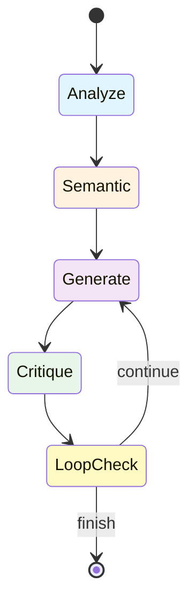

# AI Documentation Agent

<div align="center">
  <h2>🤖 Intelligent, Self-Improving Documentation Generator</h2>
  <p><strong>Version 2.0.0</strong> · An autonomous AI agent with semantic code analysis that generates, critiques, and refines technical documentation for code projects</p>
</div>

---

## Overview

AI Documentation Agent is a powerful tool that uses iterative AI refinement to create comprehensive, high-quality documentation for your codebase automatically.

### Key Features

<div class="grid cards" markdown>

-   :material-reload:{ .lg .middle } __Iterative Refinement__

    ---

    AI critiques its own output and improves through multiple refinement cycles

    [:octicons-arrow-right-24: Learn more](features/iterative-refinement.md)

-   :material-robot:{ .lg .middle } __AI-Powered__

    ---

    Uses Ollama LLM for intelligent code analysis and documentation generation

    [:octicons-arrow-right-24: Get started](getting-started/quickstart.md)

-   :material-file-multiple:{ .lg .middle } __Multi-Format__

    ---

    Export documentation in Markdown, HTML, or PDF formats

    [:octicons-arrow-right-24: Output formats](features/output-formats.md)

-   :material-brain:{ .lg .middle } __Smart Detection__

    ---

    Automatically detects project type and prioritizes important files

    [:octicons-arrow-right-24: Project detection](features/project-detection.md)

-   :material-graph:{ .lg .middle } __Semantic Analysis__

    ---

    Advanced code relationship analysis and architecture recognition

    [:octicons-arrow-right-24: Agent implementations](features/agent-implementations.md)

</div>

## Quick Start

```bash
# 1️⃣ Clone the repository
git clone https://github.com/deepak-sekarbabu/ai-doc-agent.git
cd ai-doc-agent

# 2️⃣ Create virtual environment & install
python -m venv .venv
source .venv/bin/activate      # Windows: .venv\\Scripts\\activate
pip install -e .[dev]          # Installs console scripts

# 3️⃣ Run the agent
ai-doc-agent --directory ./examples
```

!!! success "That's all!"
    The agent performs semantic analysis, generates documentation with AI refinement, and saves it in your current directory.

## How It Works



## Installation Methods

=== "Package Installation"

```bash
git clone https://github.com/deepak-sekarbabu/ai-doc-agent.git
cd ai-doc-agent
pip install -e .[dev]
    ai-doc-agent --help
    ```

=== "Docker Container"

```bash
cd build
docker build -t ai-doc-agent:latest .
    docker run --rm -v "$(pwd)/project:/src" ai-doc-agent:latest --directory /src
    ```

=== "PyInstaller Bundle"

```bash
pip install pyinstaller
    pyinstaller --onefile src/ai_agent.py --name ai-doc-agent
    ./dist/ai-doc-agent --help
    ```

## Example Output

The agent generates comprehensive documentation including:

- ✅ Project Overview & Architecture
- ✅ Semantic Code Analysis & Relationships
- ✅ Key Components with Dependencies
- ✅ Development Setup & Configuration
- ✅ Deployment Guide & Best Practices
- ✅ API Reference & Usage Examples
- ✅ Security Considerations & Testing

## What Makes It Different?

| Feature | AI Doc Agent | Traditional Tools |
|---------|--------------|-------------------|
| **Self-Improvement** | ✅ Iterative refinement | ❌ Single pass |
| **AI-Powered** | ✅ Intelligent analysis | ❌ Template-based |
| **Semantic Analysis** | ✅ Code relationships & architecture | ❌ Surface-level |
| **Quality Control** | ✅ Self-critique & validation | ❌ No validation |
| **Context-Aware** | ✅ Project type detection | ❌ Generic output |
| **State Management** | ✅ LangGraph orchestration | ❌ Manual workflows |

## Use Cases

<div class="grid" markdown>

!!! example "Open Source Projects"
    Generate professional README files and documentation for GitHub repositories

!!! example "Team Projects"
    Maintain up-to-date internal documentation automatically

!!! example "Client Deliverables"
    Produce polished technical specifications and API docs

!!! example "Learning & Portfolios"
    Document your learning projects comprehensively

</div>

## Next Steps

<div class="grid cards" markdown>

-   :material-clock-fast:{ .lg .middle } __Quick Start__

    ---

    Get up and running in 5 minutes

    [:octicons-arrow-right-24: Quick Start](getting-started/quickstart.md)

-   :material-book-open-page-variant:{ .lg .middle } __User Guide__

    ---

    Complete guide to all features

    [:octicons-arrow-right-24: User Guide](guide/overview.md)

-   :material-code-braces:{ .lg .middle } __API Reference__

    ---

    Programmatic usage and API docs

    [:octicons-arrow-right-24: API Reference](reference/api.md)

-   :material-package-variant:{ .lg .middle } __Deployment__

    ---

    Bundle and distribute your agent

    [:octicons-arrow-right-24: Bundling Guide](deployment/bundling.md)

</div>

## Requirements

| Requirement | Minimum version / notes |
|-------------|--------------------------|
| **Python** | 3.8 + (tested up to 3.12) |
| **LangGraph** | 0.2.0 |
| **pdfkit** | 0.6.1 (requires `wkhtmltopdf` binary) |
| **markdown** | 3.4 |
| **requests** | 2.31.0 |
| **python‑dotenv** | 1.0.0 |
| **git**, **curl** | For API testing and CI |
| **Ollama** | Running locally or accessible API |

See [Requirements](getting-started/installation.md#requirements) for detailed setup instructions.

## License

MIT License - See LICENSE file for details

---

<div align="center">
  <p>Made with ❤️ using AI-powered development</p>
  <p>
    <a href="https://github.com/deepak-sekarbabu/ai-doc-agent">GitHub</a> •
    <a href="getting-started/installation/">Installation</a> •
    <a href="guide/overview/">Documentation</a>
  </p>
</div>
