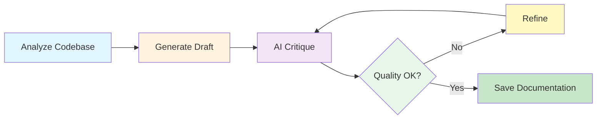

# AI Documentation Agent

<div align="center">
  <h2>🤖 Intelligent, Self-Improving Documentation Generator</h2>
  <p>An autonomous AI agent that generates, critiques, and refines technical documentation for code projects</p>
</div>

---

## Overview

AI Documentation Agent is a powerful tool that uses iterative AI refinement to create comprehensive, high-quality documentation for your codebase automatically.

### Key Features

<div class="grid cards" markdown>

-   :material-reload:{ .lg .middle } __Iterative Refinement__

    ---

    AI critiques its own output and improves through multiple refinement cycles

    [:octicons-arrow-right-24: Learn more](features/iterative-refinement.md)

-   :material-robot:{ .lg .middle } __AI-Powered__

    ---

    Uses Ollama LLM for intelligent code analysis and documentation generation

    [:octicons-arrow-right-24: Get started](getting-started/quickstart.md)

-   :material-file-multiple:{ .lg .middle } __Multi-Format__

    ---

    Export documentation in Markdown, HTML, or PDF formats

    [:octicons-arrow-right-24: Output formats](features/output-formats.md)

-   :material-brain:{ .lg .middle } __Smart Detection__

    ---

    Automatically detects project type and prioritizes important files

    [:octicons-arrow-right-24: Project detection](features/project-detection.md)

</div>

## Quick Start

```bash
# Install dependencies
pip install -r config/requirements.txt

# Configure environment
cp config/.env.example .env

# Run the agent
python run.py --directory ./your-project
```

!!! success "That's it!"
    The agent will analyze your code, generate documentation, and refine it through multiple iterations.

## How It Works



## Installation Methods

=== "Direct Usage"

    ```bash
    pip install -r config/requirements.txt
    python run.py --help
    ```

=== "Standalone Executable"

    ```bash
    cd build
    build.bat  # Windows
    ./build.sh  # Linux/Mac
    ```

=== "Docker"

    ```bash
    cd build
    docker-compose run --rm ai-doc-agent
    ```

=== "Python Package"

    ```bash
    pip install .
    ai-doc-agent --help
    ```

## Example Output

The agent generates comprehensive documentation including:

- ✅ Project Overview
- ✅ Architecture & Design
- ✅ Key Components
- ✅ Development Setup
- ✅ Deployment Guide
- ✅ API Reference
- ✅ Best Practices

## What Makes It Different?

| Feature | AI Doc Agent | Traditional Tools |
|---------|--------------|-------------------|
| **Self-Improvement** | ✅ Iterative refinement | ❌ Single pass |
| **AI-Powered** | ✅ Intelligent analysis | ❌ Template-based |
| **Quality Control** | ✅ Self-critique | ❌ No validation |
| **Context-Aware** | ✅ Project type detection | ❌ Generic output |

## Use Cases

<div class="grid" markdown>

!!! example "Open Source Projects"
    Generate professional README files and documentation for GitHub repositories

!!! example "Team Projects"
    Maintain up-to-date internal documentation automatically

!!! example "Client Deliverables"
    Produce polished technical specifications and API docs

!!! example "Learning & Portfolios"
    Document your learning projects comprehensively

</div>

## Next Steps

<div class="grid cards" markdown>

-   :material-clock-fast:{ .lg .middle } __Quick Start__

    ---

    Get up and running in 5 minutes

    [:octicons-arrow-right-24: Quick Start](getting-started/quickstart.md)

-   :material-book-open-page-variant:{ .lg .middle } __User Guide__

    ---

    Complete guide to all features

    [:octicons-arrow-right-24: User Guide](guide/overview.md)

-   :material-code-braces:{ .lg .middle } __API Reference__

    ---

    Programmatic usage and API docs

    [:octicons-arrow-right-24: API Reference](reference/api.md)

-   :material-package-variant:{ .lg .middle } __Deployment__

    ---

    Bundle and distribute your agent

    [:octicons-arrow-right-24: Bundling Guide](deployment/bundling.md)

</div>

## Requirements

- Python 3.8+
- Ollama (running locally or remote)
- wkhtmltopdf (optional, for PDF generation)

## License

MIT License - See LICENSE file for details

---

<div align="center">
  <p>Made with ❤️ using AI-powered development</p>
  <p>
    <a href="https://github.com/deepak-sekarbabu/ai-doc-agent">GitHub</a> •
    <a href="getting-started/installation/">Installation</a> •
    <a href="guide/overview/">Documentation</a>
  </p>
</div>
